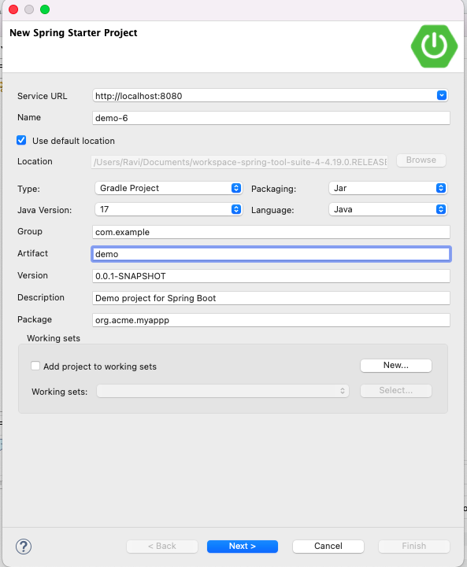

# Spring-Project-Generator
Project generator is built on top of Spring Initializr. It contains custom configuration and project contributors to change the default project generation strategy.

## Configuration:
The [configuration](https://github.com/spring-io/start.spring.io/blob/main/start-site/src/main/resources/application.yml) from spring is used as base configuration. Custom configuration from resources/config is used to override the base configuration.

## Metadata:
Spring [metadata](https://api.spring.io/project_metadata/spring-boot) is consumed by the core Spring Initializr as an external resource, to ensure the Spring Boot versions provided during project generation are always up to date.
As an optimisation, the number of calls are reduced with cache.

## Technical Details:
Project generator has 2 phases Startup and Project Generation.

### Start Up Phase:
Start the application, load the configuration, uses parent ApplicationContext and initialize the extended information.

### Project Generation Phase:
Project generation occurs in a dedicated application context (ProjectGenerationContext), which means that for every project that is generated, the context only contains configuration and components relevant to that particular project.

### Custom Classes/Files Generation:
Project Contributors along with Mustache template engine is used to generate dynamic classes/files based on certain conditions.

## Generate Project using IDE:

## Building

Invoke the build at the root of the project

----
    $ ./gradlew clean build
    $ ./gradlew bootrun
----

